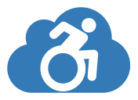

# Introduction 

MyBlog is an accessible blog engine.
It was created to have a real solution for developers that are looking for a inclusive Blog.
This project start in january 2017. It was a .net framework project. The .net Framework version is evailable here :[BugsHunter .net Framework](https://github.com/JeremyJeanson/MyBlog.net) 
This app was migrated to .net core in january 2019. Many accessible feature were added since this date. An exemple of Blog who is using this code is [BugsHunter](https://www.bugshunter.net).
 

It could be used to teach accessibility ;).

# Features
This blog engine include many features :
- Open Live Writer (it is the only way to manage blog's content). No security issues due to admin apges or something else.
- Azure (with PAAS).
- Accessible design.
- Accessible theme.
- Settings to enhance accessibility.
- Accessible Forms (Contact, Comments...).
- Greate respect of HTML standrads.
- Many SOE improvements (SiteMap, Pages...).
- Ability to posts comment.
- Authentification prior to comment.
- Authentication via social media accounts (Microsoft, Google, Twitter, FaceBook)
- Separation of blogger credentials from regular users informations.
- GDPR complient.
- HTTP to HTTPS redirection.
- Default domaine name to WWW domaine version redirection.
- Warmup with Azure web apps slot swipe.
- en-US and fr-FR localisation.
- ... and so many more to document ...

# Tech skills and libraries used
- .net Core 3.1.
- ASP .net MVC.
- TypeScript.
- Azure SQL.
- Azure Blob.
- Entity Framework Core.
- SASS.
- Bootstrap 4 (SASS version).
- Font Awesome (for icons).
- Prims js (to render code in blog posts).
- NPM.
- Gulp.

# Getting Started
## 1. Software requierments.

To edit and build this code, you need the .net Core SDK 2.2.x and Visual Studio 2017-2019 (Community, Pro, or Enterprise).

You can use Visual Studio code, but you will not be able to add new ressources (it use RESX with autogenereted class).

Some extension are used, but not requested :
- [Web Essentials 2017](https://marketplace.visualstudio.com/items?itemName=MadsKristensen.WebExtensionPack2017) to include image in CSS.
- [Multilingual App Toolkit v4.0](https://marketplace.visualstudio.com/items?itemName=MultilingualAppToolkit.MultilingualAppToolkit-18308) to include translations.
- Azure Storage Emulator (for development)

Deploiment requirements :
- An Azure subscription
- Azure SQL Database.
- Azure Storage Account (for blob).

## 2. Installation process
To use this code follow this steps :
- Clone this repository.
- Customize the configuration file (all settings are available via `appsettings.json`)
- Customize the layout file (`_Layout.cshtml` View in Shared folder)
- Customize the CSS (colors used by bootstrap 4 themes are in `default.scss`, `dark.scss` and `high-contrast.scss`. each file allow to build a standealone theme)
- Run and enjoy ;)

## 3. User creation and credentials
The user/credentials (login and password) is created when you configure your blog in Open Live Writer. The login and password passed will set the first user.

If you want to change or delete those credentials. Juste remote it from the `Publisher` table of your database. Edit your Open Live Writer account and it will create a new credential.

## 4. Blog post edition tips
If you are writing a long post, it can be split in two parts (with a link at the end of the first part "read more"). The choice to split this post isn't made by the blog engine. it is your choice.

To split a post in two part, you have to edit the HTML of the post. First part should be inside `

`. The second part should be behind the `
`.

Easy no?

## 5. Use a database from MyBlog.net (framework version) to MyBlog.net core
Prior to migrate, take time to backup your database.

MyBlog.net core use EF core for migration. The first migration include SQL to permit to switch from the .net framework app to the .net core. You have nothing to do.

You have only to update your app.

> You only have to take care to the migration process if you forked the project, and if you have made some change to the EF 6 DataContext and Models.

# Contribute
Contributions are open. Juste send your ideas or Pull Request ;)
